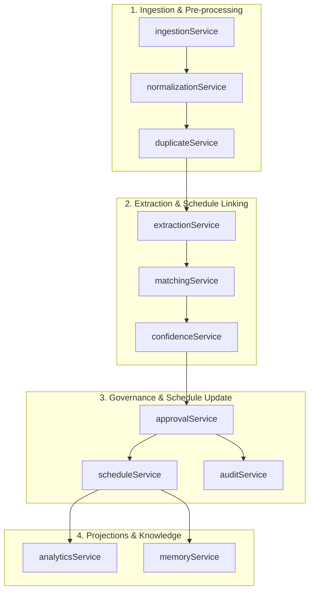

# SYSTEM ARCHITECTURE SPECIFICATION
## SIH 2026 — Problem Statement 26122 (FieldLink Platform)
**Project Title:** Intelligent Data Capture & Schedule-Linking Layer for Infrastructure Project Management: Real-Time Actual Progress Tracking (Planning-to-Execution Bridge)  
**Target Context:** Baghewala Surface Facilities Expansion (Jaisalmer Basin, Rajasthan)  
**Document Type:** Final Technical Architecture Specification  
**Status:** Approved Architecture Phase Baseline  

---

## 1. Architectural Principles & Separation of Concerns

This specification separates architectural concerns into distinct boundaries:
- **Presentation Boundary:** Interactive visualization, form controls, review interfaces, and conversational capture.
- **Application & Routing Boundary:** Node.js HTTP REST service managing client-server transactions.
- **Domain Services Boundary:** Pure, decoupled engineering services (ingestion, normalization, duplicate check, extraction, matching, confidence scoring, review/approval, schedule mutation, audit generation, analytics, and institutional memory).
- **Persistence Boundary:** Local embedded relational repository (`node:sqlite`) managing tables, indexes, and transactions.
- **External Integration Boundary:** Local Mock PMIS Adapter generating representative P6-compatible demonstration payloads without connecting to live corporate infrastructure.

---

## 2. Runtime Topology

The prototype operates on a local client-server architecture with an explicit HTTP/JSON boundary:

```
┌──────────────────────────────────────────────────────────┐
│               React + TypeScript Frontend                │
│                 Vite Dev Server (:3000)                  │
│       Operations • Queue • Gantt • Time Agent • Trace    │
└────────────────────────────┬─────────────────────────────┘
                             │ HTTP / JSON (REST API)
┌────────────────────────────▼─────────────────────────────┐
│                 Node.js API Server (:3001)               │
│          REST Endpoints • State Mutation • Routing       │
└──────────────┬────────────────────────────┬──────────────┘
               │                            │
┌──────────────▼─────────────┐ ┌────────────▼──────────────┐
│       Domain Services      │ │    Local Mock PMIS Adapter│
│  Ingestion • Normalization │ │  POST /api/mock-pmis/sync │
│  Duplicate • Extraction    │ │  Representative Payloads  │
│  Matching • Approval       │ └───────────────────────────┘
│  Audit • Analytics         │
└──────────────┬─────────────┘
               │
┌──────────────▼─────────────┐
│   node:sqlite Repository   │
│   DatabaseSync (Node 24)   │
│  data/fieldlink_project.db │
└────────────────────────────┘
```

### Runtime Processes:
1. **Frontend Client:** React 18 + TypeScript SPA served via Vite on `http://localhost:3000`.
2. **Backend API Service:** Native Node.js HTTP REST service running on `http://localhost:3001`.
3. **Database Engine:** Embedded SQLite 3 accessed natively via `node:sqlite` (`DatabaseSync`), writing to `data/fieldlink_project.db`.
4. **Client-Server Boundary:** The browser client executes no direct disk or database operations; all persistent state queries and mutations route via HTTP to the Node.js API server.

---

## 3. Component Responsibilities

### 3.1 Frontend Responsibilities (`:3000`)
- **Navigation & Views:** Routing across executive dashboards, data ingestion, extraction workspace, schedule linker, review queues, supervisor Time Agent, Gantt views, analytics, institutional memory, audit trail, and settings.
- **User Interactions:** Drag-and-drop file ingestion, text input, audio recording/transcription triggers, phrase highlight rendering, 1:N split sliders, and What-If parameter controls.
- **Human-in-the-Loop Gating:** Exposing explicit planner confirmation boundaries (`Ingest and Process for Review`, `Confirm and Submit for Review`, `Preview PMIS Update`, `Sync to Mock PMIS`).
- **Privacy Mode Filter:** Client-side masking of individual worker identities and contractor proprietary rates.
- **Reactive UI Synchronization:** Instant state reflection across components upon receiving backend API responses.

### 3.2 Backend API Responsibilities (`:3001`)
- **HTTP Routing & Protocol Translation:** Handling JSON payloads, HTTP status codes, CORS headers, and error serialization.
- **Domain Service Orchestration:** Invoking normalization, duplicate checking, extraction, multi-signal matching, and safety validation in strict sequential order.
- **Relational Persistence:** Executing SQL queries and transactions against SQLite (`data/fieldlink_project.db`).
- **Append-Only Audit Enforcement:** Writing audit records on every mutation with actor name, role, timestamp, diff snapshots, and source quotes. Preventing UI-triggered `UPDATE` or `DELETE` operations on audit tables.
- **Mock PMIS Dispatch:** Providing local endpoint `/api/mock-pmis/sync` and returning realistic demonstration responses.
- **System Health & Runtime Metrics:** Serving `/api/health` with dynamic SQLite database file size and active record counts.

---

## 4. Domain Services Decomposition

Domain logic is implemented across eleven pure, decoupled domain services:



| Service Module | Function & Scope | Inputs | Outputs |
|---|---|---|---|
| `ingestionService` | Ingests multi-format site reports (DPR text, CSV rows, scan text, audio transcripts). | Raw payload, source metadata, author info. | `FieldRecord` (`received`). |
| `normalizationService` | Normalizes date tokens to ISO `YYYY-MM-DD`, detects discipline craft, scores date parsing confidence. | Raw text, date strings. | `normalizedDate`, `dateConfidence`, `discipline`. |
| `duplicateService` | Two-tier duplicate detection: $\ge 70\%$ flags possible duplicate; $\ge 85\%$ blocks double counting pending review. | `FieldRecord` candidates. | `duplicateStatus`, `confidenceScore`, `conflictingRecordIds`. |
| `extractionService` | Extracts physical quantities, progress %, locations, equipment tags, and character span indexes. | Normalized `FieldRecord`. | `ProgressEvent[]`, `HighlightedSpan[]`. |
| `matchingService` | Computes 6-signal linear weighted score, applies Level 6 tie-breaker, evaluates score gaps. | `ProgressEvent`, `ScheduleActivity[]`. | Ranked `MatchCandidate[]`, component score breakdowns. |
| `confidenceService` | Categorizes candidates into High ($\ge 85\%$), Medium ($60\%-84\%$), and Low/Unmatched ($<60\%$). Flags ambiguity if score gap $<10\%$. | Ranked candidates. | `ConfidenceTier`, `fastTrackEligible` boolean. |
| `approvalService` | Enforces planner approval gates, predecessor completion checks, 1:N allocations, and new activity proposals. | `eventId`, `PlannerDecision`, activities. | `ApprovalResult`, safety validation report. |
| `scheduleService` | Mutates schedule metrics (actual start/finish, physical % complete, actual duration, duration variance). | Approved `ProgressEvent`. | Updated `ScheduleActivity`. |
| `auditService` | Appends historical change records capturing Actor, Role, Timestamp, Before/After diff, Reason, and Evidence snippet. | State mutation payload. | `AuditEntry`, 6-point evidence lineage chain. |
| `analyticsService` | Computes cumulative S-Curves, discipline productivity, What-If delay ripples, and indicative forecasts with fallbacks. | `ScheduleActivity[]`, `DataDate`. | S-Curve data, productivity velocities, indicative forecast. |
| `memoryService` | Synthesizes institutional lessons, equipment bottlenecks, and delay patterns from approved progress logs. | Approved events, audit logs. | `ProjectMemoryItem[]`, `DelayPattern[]`. |

---

## 5. Local Mock PMIS Adapter Boundaries

To maintain strict technical honesty and eliminate false integration claims:
1. **No Live Corporate Connections:** The prototype does **not** connect to live Oracle Primavera P6 Cloud or internal PMIS production endpoints.
2. **Local Mock Route:** All synchronization actions dispatch to:
   ```
   POST /api/mock-pmis/sync
   ```
3. **Representative Demonstration Payloads:** The adapter generates structured REST JSON and SOAP XML payloads formatted according to official Primavera P6 EPPM schema specifications:
   - Contains fields: `activityCode`, `status`, `actualStartDate`, `actualFinishDate`, `physicalPercentComplete`, `auditReference`.
   - Explicitly stamped with demonstration headers:
     - `X-Demonstration-Mode: TRUE`
     - `X-Mock-Adapter: Local Mock PMIS Adapter`
     - `X-Notice: Representative P6-compatible demonstration payload`
4. **Adapter Simulation Response:**
   ```json
   {
     "status": "simulated",
     "success": true,
     "transactionId": "TX-DEMO-001",
     "activityCode": "PIP-L6-024A",
     "message": "Representative payload accepted by local mock adapter",
     "syncedAt": "2026-09-19T14:25:00.000Z"
   }
   ```
5. **UI Labeling:** Interfaces use explicit labels:
   - Action buttons: `Preview PMIS Update` $\rightarrow$ `Sync to Mock PMIS`.
   - Inspection drawer: `Representative PMIS Payload (Demonstration Mode)`.

---

## 6. Audit Trail & Integrity Model

### 6.1 Append-Only Audit Trail
- The audit ledger is strictly **append-only**.
- **Interface Restriction:** Existing audit records cannot be edited or deleted through any frontend interface or REST API endpoint.
- **Actor Attribution:** Every entry records the logged-in actor name (`Lead Planner`, `Field Supervisor`), actor role, ISO timestamp, pre-change snapshot, post-change snapshot, justification reason, and raw evidence reference.

### 6.2 Technical Scope of Integrity Claims
- The system is designed for **auditability and governance within the application boundary**.
- It does **not** claim cryptographic blockchain immutability, hardware non-repudiation, or PSU-certified external compliance.
- UI badges and documentation strictly state: `Append-Only Audit Trail — Prototype`.

---

## 7. Evidence Lineage Chain Architecture

The system maintains an unbroken, forward 6-point causal chain linking raw physical inputs to approved schedule updates:

```
[1. Source File]
       │ (DPR scan, CSV table, voice audio, text report)
       ▼
[2. Extracted Snippet]
       │ (Exact raw text phrase with character bounding indexes)
       ▼
[3. Structured Progress Event]
       │ (Normalized entity: quantity, UOM, date, discipline)
       ▼
[4. Ranked Schedule Match]
       │ (6-signal weighted score, component breakdown, L6 tie-breaker)
       ▼
[5. Planner Approval Gate]
       │ (Attributed decision, safety checks, predecessor justification)
       ▼
[6. Approved Schedule Update]
       └── [Supporting Detail: Representative Mock PMIS Payload]
```

The representative mock PMIS payload is attached as a supporting inspection detail under Step 6, preserving the true physical-to-schedule causal flow.

---

## 8. Dynamic System Metrics & Error Handling

### 8.1 Dynamic Metadata
The system rejects hardcoded database size and reset latency figures:
- **Database Size:** Calculated at runtime by querying SQLite `page_count` $\times$ `page_size` via Node.js native filesystem checks.
- **Active Records:** Aggregated dynamically from SQLite tables (`1 project · 19 activities · 7 field records · 8 audit entries`).
- **Reset Latency:** Measured dynamically via high-resolution performance timers (`performance.now()`), displaying simple confirmation: `Reset complete`.

### 8.2 Error Handling & Resilience
- **Database Connection Failure:** If SQLite fails to initialize, the backend returns HTTP 500 with a detailed configuration diagnostic; the frontend displays a clear connection alert.
- **Validation Violations:** Negative progress, quantity overruns ($>120\%$), or out-of-sequence approvals without justifications are blocked with HTTP 422 and actionable remediation notes.
- **Duplicate Conflicts:** Records matching existing progress within the same date and craft are flagged ($\ge 70\%$) or blocked ($\ge 85\%$) to prevent schedule corruption.
