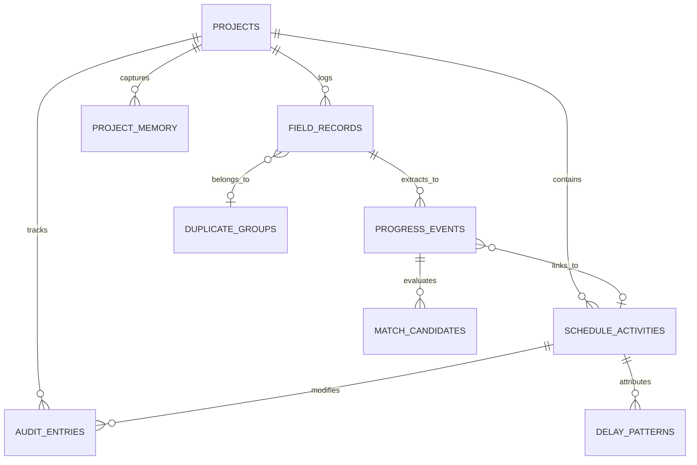

# DATABASE SCHEMA SPECIFICATION
## SIH 2026 — Problem Statement 26122 (Oil India Limited)
**Project Title:** Intelligent Data Capture & Schedule-Linking Layer for Infrastructure Project Management: Real-Time Actual Progress Tracking  
**Target Context:** Baghewala Surface Facilities Expansion (Jaisalmer Basin, Rajasthan)  
**Database Engine:** Local SQLite 3 via `node:sqlite` (Node.js 24 Built-in Native Driver)  
**Database File:** `data/oil_india_baghewala.db`

---

## 1. Relational Architecture & Pragmas

The database provides a local, zero-license, zero-cloud relational store for the Baghewala expansion project. The schema enforces foreign key integrity, append-only audit semantics, and deterministic query execution.

```sql
PRAGMA journal_mode = WAL;
PRAGMA foreign_keys = ON;
PRAGMA synchronous = NORMAL;
PRAGMA encoding = "UTF-8";
```

---

## 2. Entity Relationship Diagram



---

## 3. Data Definition Language (DDL)

### 3.1 `projects` Table
Stores root project metadata, baseline dates, and status cutoff dates.

```sql
CREATE TABLE IF NOT EXISTS projects (
    id TEXT PRIMARY KEY,
    project_code TEXT NOT NULL UNIQUE,
    name TEXT NOT NULL,
    location TEXT NOT NULL,
    data_date TEXT NOT NULL,                -- ISO 8601: YYYY-MM-DD (e.g. 2026-09-19)
    planned_start TEXT NOT NULL,            -- ISO 8601: YYYY-MM-DD
    planned_finish TEXT NOT NULL,           -- ISO 8601: YYYY-MM-DD
    currency TEXT DEFAULT 'INR',
    budget_crores REAL NOT NULL,
    status TEXT NOT NULL DEFAULT 'ACTIVE',
    created_at TEXT NOT NULL DEFAULT (datetime('now')),
    updated_at TEXT NOT NULL DEFAULT (datetime('now'))
);
```

### 3.2 `schedule_activities` Table
Stores Level 5 Work Packages and Level 6 Executable Activities mapped from baseline engineering schedule.

```sql
CREATE TABLE IF NOT EXISTS schedule_activities (
    id TEXT PRIMARY KEY,
    project_id TEXT NOT NULL REFERENCES projects(id) ON DELETE CASCADE,
    activity_code TEXT NOT NULL UNIQUE,      -- e.g. PIP-L6-024A
    wbs_code TEXT NOT NULL,                  -- e.g. BAGH.SURF.PIP.RACK-NORTH
    parent_wbs TEXT NOT NULL,
    description TEXT NOT NULL,
    discipline TEXT NOT NULL CHECK (discipline IN (
        'PIPING', 'CIVIL', 'ELECTRICAL', 'INSTRUMENTATION', 
        'STATIC_EQUIP', 'ROTATING_EQUIP', 'HSE'
    )),
    level INTEGER NOT NULL CHECK (level IN (5, 6)),
    planned_start TEXT NOT NULL,             -- ISO YYYY-MM-DD
    planned_finish TEXT NOT NULL,            -- ISO YYYY-MM-DD
    planned_duration REAL NOT NULL,          -- Days
    actual_start TEXT,                       -- ISO YYYY-MM-DD
    actual_finish TEXT,                      -- ISO YYYY-MM-DD
    actual_duration REAL DEFAULT 0.0,        -- Days
    duration_variance REAL DEFAULT 0.0,      -- actual_duration - planned_duration
    planned_quantity REAL NOT NULL,
    actual_quantity REAL DEFAULT 0.0,
    remaining_quantity REAL NOT NULL,
    uom TEXT NOT NULL,                       -- joints, m, m3, each, %
    percent_complete REAL NOT NULL DEFAULT 0.0 CHECK (percent_complete >= 0.0 AND percent_complete <= 100.0),
    status TEXT NOT NULL CHECK (status IN ('Not Started', 'In Progress', 'Completed')),
    location TEXT NOT NULL,
    predecessor_ids TEXT NOT NULL DEFAULT '[]', -- JSON Array of activity IDs
    successor_ids TEXT NOT NULL DEFAULT '[]',   -- JSON Array of activity IDs
    sync_status TEXT NOT NULL DEFAULT 'pending' CHECK (sync_status IN ('synced', 'pending', 'failed')),
    last_synced_at TEXT,
    created_at TEXT NOT NULL DEFAULT (datetime('now')),
    updated_at TEXT NOT NULL DEFAULT (datetime('now'))
);

CREATE INDEX IF NOT EXISTS idx_activities_code ON schedule_activities(activity_code);
CREATE INDEX IF NOT EXISTS idx_activities_discipline ON schedule_activities(discipline);
CREATE INDEX IF NOT EXISTS idx_activities_level ON schedule_activities(level);
CREATE INDEX IF NOT EXISTS idx_activities_status ON schedule_activities(status);
```

### 3.3 `field_records` Table
Stores raw captured inputs from multiple multi-modal sources before extraction.

```sql
CREATE TABLE IF NOT EXISTS field_records (
    id TEXT PRIMARY KEY,
    project_id TEXT NOT NULL REFERENCES projects(id) ON DELETE CASCADE,
    source_type TEXT NOT NULL CHECK (source_type IN ('dpr', 'spreadsheet', 'scan', 'voice', 'delay_notice')),
    source_name TEXT NOT NULL,               -- e.g. DPR_2026_09_12_Piping.pdf
    submitted_by TEXT NOT NULL,              -- Author attribution
    discipline TEXT CHECK (discipline IN (
        'PIPING', 'CIVIL', 'ELECTRICAL', 'INSTRUMENTATION', 
        'STATIC_EQUIP', 'ROTATING_EQUIP', 'HSE'
    )),
    source_date_text TEXT,                   -- Raw date token from input
    normalized_date TEXT,                    -- Standardized ISO YYYY-MM-DD
    date_confidence REAL DEFAULT 1.0,        -- 0.0 - 1.0
    raw_text TEXT NOT NULL,                  -- Full text content
    evidence_reference TEXT,                 -- Path to file/snippet
    processing_status TEXT NOT NULL CHECK (processing_status IN (
        'received', 'parsing', 'normalized', 'ready_for_extraction', 
        'extracted', 'matched', 'pending_review', 'approved', 'rejected'
    )),
    duplicate_status TEXT NOT NULL DEFAULT 'unique' CHECK (duplicate_status IN (
        'unique', 'possible-duplicate', 'confirmed-duplicate', 'resolved'
    )),
    duplicate_group_id TEXT,
    created_at TEXT NOT NULL DEFAULT (datetime('now')),
    updated_at TEXT NOT NULL DEFAULT (datetime('now'))
);

CREATE INDEX IF NOT EXISTS idx_field_records_date ON field_records(normalized_date);
CREATE INDEX IF NOT EXISTS idx_field_records_status ON field_records(processing_status);
CREATE INDEX IF NOT EXISTS idx_field_records_duplicate ON field_records(duplicate_status);
```

### 3.4 `duplicate_groups` Table
Clusters records flagged for duplicate work logging review.

```sql
CREATE TABLE IF NOT EXISTS duplicate_groups (
    id TEXT PRIMARY KEY,
    normalized_date TEXT NOT NULL,
    discipline TEXT NOT NULL,
    equipment_tag TEXT,
    similarity_score REAL NOT NULL,          -- 0.0 - 100.0
    status TEXT NOT NULL DEFAULT 'open' CHECK (status IN ('open', 'resolved', 'confirmed_duplicate')),
    resolution_notes TEXT,
    resolved_by TEXT,
    resolved_at TEXT,
    created_at TEXT NOT NULL DEFAULT (datetime('now'))
);
```

### 3.5 `progress_events` Table
Stores extracted structured progress events parsed from raw field records.

```sql
CREATE TABLE IF NOT EXISTS progress_events (
    id TEXT PRIMARY KEY,
    source_record_id TEXT NOT NULL REFERENCES field_records(id) ON DELETE CASCADE,
    matched_activity_id TEXT REFERENCES schedule_activities(id) ON DELETE SET NULL,
    event_date TEXT NOT NULL,                -- ISO YYYY-MM-DD
    raw_snippet TEXT NOT NULL,               -- Exact source quote
    bounding_box TEXT,                       -- JSON: { startChar, endChar }
    quantity REAL,                           -- Physical quantity
    uom TEXT,                                -- joints, m, m3, each
    progress_percentage REAL CHECK (progress_percentage >= 0.0 AND progress_percentage <= 100.0),
    confidence_tier TEXT NOT NULL CHECK (confidence_tier IN ('HIGH', 'MEDIUM', 'LOW', 'UNMATCHED')),
    best_match_score REAL DEFAULT 0.0,       -- 0.0 - 100.0
    validation_status TEXT NOT NULL CHECK (validation_status IN (
        'pending_review', 'fast_track_eligible', 'approved', 'split', 'rejected', 'proposed_new'
    )),
    out_of_sequence INTEGER NOT NULL DEFAULT 0 CHECK (out_of_sequence IN (0, 1)),
    planner_justification TEXT,
    reviewed_by TEXT,
    reviewed_at TEXT,
    created_at TEXT NOT NULL DEFAULT (datetime('now')),
    updated_at TEXT NOT NULL DEFAULT (datetime('now'))
);

CREATE INDEX IF NOT EXISTS idx_progress_events_status ON progress_events(validation_status);
CREATE INDEX IF NOT EXISTS idx_progress_events_act ON progress_events(matched_activity_id);
```

### 3.6 `match_candidates` Table
Stores candidate schedule activities evaluated against each progress event by the 6-signal matching engine.

```sql
CREATE TABLE IF NOT EXISTS match_candidates (
    id TEXT PRIMARY KEY,
    event_id TEXT NOT NULL REFERENCES progress_events(id) ON DELETE CASCADE,
    activity_id TEXT NOT NULL REFERENCES schedule_activities(id) ON DELETE CASCADE,
    activity_code TEXT NOT NULL,
    rank INTEGER NOT NULL,                   -- 1, 2, 3
    base_score REAL NOT NULL,                -- Weighted multi-signal score (0 - 100)
    score_text REAL NOT NULL,                -- 30% weight
    score_discipline REAL NOT NULL,          -- 20% weight
    score_location REAL NOT NULL,            -- 15% weight
    score_wbs REAL NOT NULL,                 -- 15% weight
    score_date REAL NOT NULL,                -- 10% weight
    score_synonym REAL NOT NULL,             -- 10% weight
    level_6_tie_breaker_applied INTEGER DEFAULT 0 CHECK (level_6_tie_breaker_applied IN (0, 1)),
    score_gap_from_leader REAL DEFAULT 0.0,
    is_ambiguous INTEGER DEFAULT 0 CHECK (is_ambiguous IN (0, 1)),
    matched_terms TEXT,                      -- JSON Array of matched strings
    explanation TEXT NOT NULL,
    created_at TEXT NOT NULL DEFAULT (datetime('now'))
);

CREATE INDEX IF NOT EXISTS idx_candidates_event ON match_candidates(event_id);
CREATE INDEX IF NOT EXISTS idx_candidates_rank ON match_candidates(event_id, rank);
```

### 3.7 `audit_entries` Table
Maintains an append-only, planner-attributed change ledger. Records cannot be edited or deleted through application interfaces.

```sql
CREATE TABLE IF NOT EXISTS audit_entries (
    id TEXT PRIMARY KEY,
    project_id TEXT NOT NULL REFERENCES projects(id) ON DELETE CASCADE,
    timestamp TEXT NOT NULL,                 -- ISO 8601: YYYY-MM-DDTHH:mm:ss+05:30
    actor_name TEXT NOT NULL,                -- Lead Planner, Supervisor, etc.
    actor_role TEXT NOT NULL,                -- PLANNER | SUPERVISOR | ENGINEER | PM
    action TEXT NOT NULL CHECK (action IN (
        'INGEST', 'EXTRACT', 'APPROVE', 'REMAP', 'SPLIT', 'REJECT', 
        'PROPOSE_NEW', 'MOCK_PMIS_SYNC', 'RESET_BASELINE'
    )),
    entity_type TEXT NOT NULL,               -- ScheduleActivity | ProgressEvent | FieldRecord
    entity_id TEXT NOT NULL,
    before_value TEXT,                       -- JSON snapshot of pre-state
    after_value TEXT NOT NULL,               -- JSON snapshot of post-state
    reason TEXT NOT NULL,                    -- Planner rationale or system trigger
    evidence_reference TEXT,                 -- Lineage link to source file/snippet
    transaction_id TEXT,                     -- e.g. TX-DEMO-001
    created_at TEXT NOT NULL DEFAULT (datetime('now'))
);

CREATE INDEX IF NOT EXISTS idx_audit_entity ON audit_entries(entity_type, entity_id);
CREATE INDEX IF NOT EXISTS idx_audit_timestamp ON audit_entries(timestamp);
CREATE INDEX IF NOT EXISTS idx_audit_action ON audit_entries(action);
```

### 3.8 `project_memory` & `delay_patterns` Tables
Maintains institutional knowledge, recurring bottleneck metrics, and delay patterns synthesized from approved progress logs.

```sql
CREATE TABLE IF NOT EXISTS project_memory (
    id TEXT PRIMARY KEY,
    project_id TEXT NOT NULL REFERENCES projects(id) ON DELETE CASCADE,
    discipline TEXT NOT NULL,
    category TEXT NOT NULL CHECK (category IN ('bottleneck', 'productivity', 'sequencing', 'vendor')),
    title TEXT NOT NULL,
    summary TEXT NOT NULL,
    observed_metric TEXT,                    -- e.g. "+5 days delay"
    recommended_mitigation TEXT NOT NULL,
    associated_activity_code TEXT,
    created_at TEXT NOT NULL DEFAULT (datetime('now'))
);

CREATE TABLE IF NOT EXISTS delay_patterns (
    id TEXT PRIMARY KEY,
    project_id TEXT NOT NULL REFERENCES projects(id) ON DELETE CASCADE,
    cause_code TEXT NOT NULL,                -- EQUIP_UNAVAILABLE, WEATHER, PERMIT_HOLD
    description TEXT NOT NULL,
    occurrence_count INTEGER NOT NULL DEFAULT 1,
    cumulative_slip_days REAL NOT NULL DEFAULT 0.0,
    impacted_disciplines TEXT NOT NULL,      -- JSON Array
    first_detected TEXT NOT NULL,
    last_detected TEXT NOT NULL
);
```

### 3.9 `app_settings` Table
Key-value configuration store for demonstration parameters, privacy mode, and confidence thresholds.

```sql
CREATE TABLE IF NOT EXISTS app_settings (
    key TEXT PRIMARY KEY,
    value TEXT NOT NULL,                    -- JSON serialized value
    updated_at TEXT NOT NULL DEFAULT (datetime('now'))
);
```

---

## 4. Query Optimization & Integrity Rules

1. **Foreign Key Enforcement:** Foreign key cascading deletion is enabled for child records belonging to deleted parent events, ensuring referential consistency.
2. **Append-Only Audit Policy:** The application server contains no `UPDATE` or `DELETE` endpoints for the `audit_entries` table. All mutations execute strictly via `INSERT INTO audit_entries`.
3. **Dynamic Database Metrics:** The database size is calculated at runtime using SQLite page counts:
   $$\text{Database Size} = \text{page\_count} \times \text{page\_size}$$
   Avoiding fixed or misleading static metrics.
