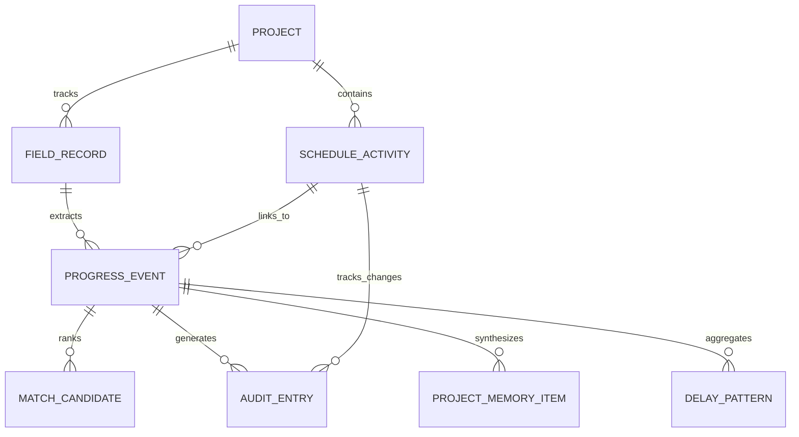

# DATA DICTIONARY & SCHEMA SPECIFICATION
## SIH 2026 — Problem Statement 26122 (FieldLink Platform)
**Project Title:** Intelligent Data Capture & Schedule-Linking Layer for Infrastructure Project Management: Real-Time Actual Progress Tracking  
**Target Context:** Baghewala Surface Facilities Expansion (Rajasthan)  

---

## 1. Entity-Relationship Architecture



---

## 2. Core Enumerations & Domain Types

```typescript
export type Discipline = 
  | 'CIVIL'
  | 'PIPING'
  | 'STATIC_EQUIP'
  | 'ROTATING_EQUIP'
  | 'ELECTRICAL'
  | 'INSTRUMENTATION'
  | 'HSE';

export type SourceType = 
  | 'report'          // Free-text daily progress report (DPR)
  | 'spreadsheet'     // Discipline Excel / CSV table
  | 'diary'           // Scanned site diary / handwritten log simulation
  | 'voice'           // Supervisor audio transcript / Time Agent
  | 'manual';         // Planner / engineer manual record

export type ProcessingStatus = 
  | 'received' 
  | 'parsing' 
  | 'normalized' 
  | 'ready_for_extraction';

export type ProgressMethod = 
  | 'quantity-based' 
  | 'percentage-based' 
  | 'milestone-based' 
  | 'duration-based';

export type VerificationStatus = 
  | 'unverified' 
  | 'planner-confirmed';

export type ConfidenceLevel = 
  | 'HIGH'            // >= 85%: Fast-Track Review / 1-Click Approve
  | 'MEDIUM'          // 60% - 84%: Mandatory Planner Review Required
  | 'LOW'             // < 60%: Unmatched / New Activity Candidate
  | 'UNMATCHED';

export type MatchMethod = 
  | 'multi-signal' 
  | 'synonym-mapped' 
  | 'fuzzy-token' 
  | 'rule-based' 
  | 'manual-override';

export type ValidationStatus = 
  | 'pending' 
  | 'approved' 
  | 'rejected' 
  | 'rematched' 
  | 'new-activity-proposed';

export type MappingType = 
  | '1:1' 
  | '1:N' 
  | 'new-activity';

export type DuplicateStatus = 
  | 'unique' 
  | 'possible-duplicate' 
  | 'confirmed-duplicate' 
  | 'duplicate-rejected';

export type EvidenceType = 
  | 'text' 
  | 'spreadsheet' 
  | 'scan' 
  | 'voice-transcript' 
  | 'photo' 
  | 'manual-entry';

export type MemoryType = 
  | 'duration' 
  | 'bottleneck' 
  | 'delay' 
  | 'productivity' 
  | 'lesson';
```

---

## 3. Detailed Entity Schema Specifications

### 3.1 `Project`
Represents the overarching infrastructure asset and scheduling context.

| Field Name | Type | Nullable | Constraints / Format | Description & Example |
|---|---|---|---|---|
| `id` | `string` | No | UUID / Slug | Unique project identifier (e.g., `'proj-baghewala-01'`) |
| `name` | `string` | No | String | Official project name: `'Baghewala Surface Facilities Expansion'` |
| `client` | `string` | No | String | Owner organization: `'Enterprise Capital Projects'` |
| `location` | `string` | No | String | Physical site: `'Jaisalmer Basin, Rajasthan, India'` |
| `status` | `string` | No | Enum: `'Active' \| 'Commissioning'` | Current project execution state |
| `startDate` | `string` | No | ISO 8601: `YYYY-MM-DD` | Project inception date: `'2026-08-01'` |
| `plannedFinishDate` | `string` | No | ISO 8601: `YYYY-MM-DD` | Contractual milestone finish: `'2027-04-30'` |
| `dataDate` | `string` | No | ISO 8601: `YYYY-MM-DD` | Schedule progress cutoff date: `'2026-09-19'` |
| `timezone` | `string` | No | IANA Timezone | Project operational timezone: `'Asia/Kolkata'` |

---

### 3.2 `ScheduleActivity`
Represents a planned Level 5 (Work Package) or Level 6 (Terminal Field Activity) from the Primavera P6 baseline.

| Field Name | Type | Nullable | Constraints / Format | Description & Example |
|---|---|---|---|---|
| `id` | `string` | No | UUID / Key | Primary activity key (e.g., `'act-pip-024a'`) |
| `activityCode` | `string` | No | P6 Format Regex: `^[A-Z]{3}-L[56]-[0-9]{3}[A-Z]?$` | Primavera activity code (e.g., `'PIP-L6-024A'`) |
| `parentWbs` | `string` | No | WBS path string | Hierarchical location (e.g., `'BAGH.SURF.PIP.RACK-NORTH'`) |
| `level` | `number` | No | Integer: `5 \| 6` | Schedule depth level (L5 Work Package vs. L6 Executable) |
| `discipline` | `Discipline` | No | Enum | Engineering craft (e.g., `'PIPING'`, `'CIVIL'`, `'ELECTRICAL'`) |
| `description` | `string` | No | String | Official description: `'Erect Line 24-XX'` |
| `location` | `string` | No | String | Exact facility zone: `'North Pipe Rack - Bay 3 to 7'` |
| `unit` | `string` | No | Unit string | Unit of measurement: `'joints'`, `'meters'`, `'m³'`, `'nos'` |
| `plannedQuantity` | `number` | No | Float $\ge 0$ | Total scope baseline quantity: `24` |
| `actualQuantity` | `number` | No | Float $\ge 0$ | Verified completed quantity (initialized to `0`, updated upon planner approval): `18` |
| `remainingQuantity` | `number` | No | Float $\ge 0$ | Remaining scope quantity (initialized to `plannedQuantity`): `6` |
| `progressMethod` | `ProgressMethod`| No | Enum | Default progress calculation basis: `'quantity-based'` |
| `plannedStart` | `string` | No | ISO 8601: `YYYY-MM-DD` | Baseline early start date: `'2026-09-10'` |
| `plannedFinish` | `string` | No | ISO 8601: `YYYY-MM-DD` | Baseline early finish date: `'2026-09-16'` |
| `actualStart` | `string` | Yes | ISO 8601: `YYYY-MM-DD` | Verified actual commencement date: `'2026-09-12'` |
| `actualFinish` | `string` | Yes | ISO 8601: `YYYY-MM-DD` | Verified actual completion date: `null` (in progress) |
| `baselineDuration`| `number` | No | Integer $\ge 1$ (days) | Planned work duration: `6` |
| `actualDuration` | `number` | Yes | Float (days) | Elapsed execution duration: `4.5` |
| `durationVariance`| `number` | Yes | Float (+/- days) | Variance against baseline: `+2.4` (slippage) |
| `predecessorIds` | `string[]` | No | Array of Activity IDs | Upstream dependencies (e.g., `['act-pip-021']`) |
| `status` | `string` | No | Enum: `'Not Started' \| 'In Progress' \| 'Completed'` | Current schedule status |
| `percentComplete` | `number` | No | Float: `0` to `100` | Current physical percent complete: `75.0` |
| `syncStatus` | `string` | No | Enum: `'synced' \| 'pending_sync'` | Simulated PMIS / P6 synchronizer state |

---

### 3.3 `FieldRecord`
Represents an un-parsed or partially parsed batch of raw field data captured through any ingestion channel.

| Field Name | Type | Nullable | Constraints / Format | Description & Example |
|---|---|---|---|---|
| `id` | `string` | No | UUID | Field record identifier (e.g., `'rec-dpr-20260912-01'`) |
| `sourceType` | `SourceType` | No | Enum | Ingestion modality (`'report'`, `'spreadsheet'`, `'voice'`) |
| `sourceName` | `string` | No | String | File or channel name: `'Daily_Progress_Report_Piping_12Sep.pdf'` |
| `submittedBy` | `string` | No | String / Masked | Field author: `'R. Sharma (Site Supervisor - Piping)'` |
| `discipline` | `Discipline` | No | Enum | Primary craft domain identified: `'PIPING'` |
| `submittedAt` | `string` | No | ISO 8601 with time | Ingestion timestamp: `'2026-09-12T17:45:00+05:30'` |
| `sourceDateText` | `string` | Yes | Raw string from text | Original date token extracted: `'12 Sep 2026'` |
| `normalizedDate` | `string` | No | ISO 8601: `YYYY-MM-DD` | Normalized target execution date: `'2026-09-12'` |
| `dateConfidence` | `number` | No | Float: `0` to `100` | Date interpretation confidence: `98.0` |
| `rawText` | `string` | No | Multiline text | Exact verbatim input text |
| `extractedEventIds`| `string[]`| No | Array of Event IDs | Pointer to child structured progress events |
| `evidenceReference`| `string`| No | URI / File reference | Storage pointer: `'/evidence/dpr/20260912_piping.pdf#page=1'` |
| `processingStatus`| `ProcessingStatus`| No | Enum | Ingestion pipeline stage: `'ready_for_extraction'` |
| `duplicateStatus` | `DuplicateStatus` | No | Enum | Duplicate state: `'unique'` |
| `duplicateGroupId`| `string` | Yes | UUID | Group ID clustering potential duplicates |

---

### 3.4 `ProgressEvent`
Represents an individual, structured activity execution event extracted from a raw field record.

| Field Name | Type | Nullable | Constraints / Format | Description & Example |
|---|---|---|---|---|
| `id` | `string` | No | UUID | Progress event key (e.g., `'ev-20260912-001'`) |
| `fieldRecordId` | `string` | No | Foreign Key $\rightarrow$ `FieldRecord` | Parent raw submission pointer |
| `activityDescription`| `string` | No | String | Extracted description: `'Spool erection for Line 24-XX'` |
| `candidateActivityId`| `string` | Yes | Foreign Key $\rightarrow$ `ScheduleActivity` | Top-ranked candidate activity ID |
| `mappingType` | `MappingType` | No | Enum | Granularity mapping: `'1:1' \| '1:N' \| 'new-activity'` |
| `mappedActivityIds` | `string[]` | No | Array of Activity IDs | Array of mapped L5/L6 activities |
| `allocationBreakdown`| `object[]` | Yes | Array: `{activityId, allocationPercent}` | 1:N distribution breakdown summing to 100% |
| `actualStart` | `string` | Yes | ISO 8601: `YYYY-MM-DD` | Extracted start date: `'2026-09-12'` |
| `actualFinish` | `string` | Yes | ISO 8601: `YYYY-MM-DD` | Extracted finish date: `null` |
| `statusDate` | `string` | Yes | ISO 8601: `YYYY-MM-DD` | Status evaluation date: `'2026-09-19'` |
| `progressMethod` | `ProgressMethod` | No | Enum | Measurement basis: `'quantity-based'` |
| `progressValue` | `number` | No | Float: `0` to `100` | Reported or calculated progress percentage: `75.0` |
| `progressUnit` | `string` | Yes | String | Measurement unit: `'joints'` |
| `quantity` | `number` | Yes | Float $\ge 0$ | Verified physical work quantity completed: `18` |
| `impliedQuantity`| `number` | Yes | Float $\ge 0$ | Calculated indicative quantity if only % reported: `18` |
| `verificationStatus`| `VerificationStatus`| No | Enum | Verification state: `'planner-confirmed'` |
| `location` | `string` | Yes | String | Extracted site zone: `'North pipe rack'` |
| `discipline` | `Discipline` | No | Enum | Engineering domain: `'PIPING'` |
| `manpower` | `string` | Yes | String | Crew count / allocation: `'6 welders, 4 riggers, 1 supervisor'` |
| `equipment` | `string` | Yes | String | Plant equipment used: `'Hydra Crane 14T (CR-04)'` |
| `delayCause` | `string` | Yes | String | Bottleneck identified (e.g., `'Test pump unavailable'`) |
| `confidenceScore`| `number` | No | Float: `0` to `100` | Composite matching score: `94.2` |
| `confidenceLevel`| `ConfidenceLevel`| No | Enum | Classification: `'HIGH' \| 'MEDIUM' \| 'LOW' \| 'UNMATCHED'` |
| `matchMethod` | `MatchMethod` | No | Enum | Primary matching algorithm: `'multi-signal'` |
| `validationStatus`| `ValidationStatus`| No | Enum | Approval state: `'approved' \| 'pending'` |
| `outOfSequence` | `boolean` | No | Boolean | True if predecessor logic incomplete |
| `plannerJustification`| `string` | Yes | String | Planner's reason for approval/override |
| `reviewerId` | `string` | Yes | String / Masked | Planner username: `'planner.ghosh'` |
| `reviewedAt` | `string` | Yes | ISO 8601 with time | Approval timestamp: `'2026-09-12T18:15:20+05:30'` |
| `evidenceSnippet`| `string` | No | String | Raw text quote backing this event |
| `evidenceUri` | `string` | No | URI | Direct link to source document snippet |

---

### 3.5 `MatchCandidate`
Represents an individual candidate L5/L6 activity ranked against an extracted progress event.

| Field Name | Type | Nullable | Constraints / Format | Description & Example |
|---|---|---|---|---|
| `id` | `string` | No | UUID | Match candidate key |
| `progressEventId` | `string` | No | Foreign Key $\rightarrow$ `ProgressEvent` | Target event being evaluated |
| `activityId` | `string` | No | Foreign Key $\rightarrow$ `ScheduleActivity` | Evaluated schedule activity |
| `score` | `number` | No | Float: `0` to `100` | Composite match score: `94.2` |
| `textSimilarity` | `number` | No | Float: `0` to `100` | Token & n-gram similarity: `92.0` (weight: 0.30) |
| `disciplineFit` | `number` | No | Float: `0` to `100` | Domain match score: `100.0` (weight: 0.20) |
| `locationFit` | `number` | No | Float: `0` to `100` | Spatial / zone score: `95.0` (weight: 0.15) |
| `wbsFit` | `number` | No | Float: `0` to `100` | WBS branch hierarchy score: `90.0` (weight: 0.15) |
| `dateConsistency`| `number` | No | Float: `0` to `100` | Chronological plausibility: `100.0` (weight: 0.10) |
| `terminologyMatch`| `number` | No | Float: `0` to `100` | Synonym dictionary match: `88.0` (weight: 0.10) |
| `matchedTerms` | `string[]` | No | Array of strings | Shared tokens: `['spool', 'erect', 'line', '24-xx', 'north', 'rack']` |
| `mismatchReasons`| `string[]` | Yes | Array of strings | Gaps identified: `['Slight location token divergence']` |
| `explanation` | `string` | No | Multiline explanation | Clear rationale for planner transparency |

---

### 3.6 `AuditEntry`
Represents an append-only audit entry capturing every state mutation and schedule change.

| Field Name | Type | Nullable | Constraints / Format | Description & Example |
|---|---|---|---|---|
| `id` | `string` | No | UUID | Audit entry key (e.g., `'aud-20260912-004'`) |
| `entityType` | `string` | No | Enum: `'ProgressEvent' \| 'ScheduleActivity'` | Type of entity modified |
| `entityId` | `string` | No | Foreign Key | ID of the mutated record |
| `action` | `string` | No | Enum: `'CREATE' \| 'EXTRACT' \| 'MATCH' \| 'APPROVE' \| 'REMAP' \| 'SYNC'` | Operational action performed |
| `actor` | `string` | No | String / Masked | User or system component: `'S. Ghosh (Lead Planner)'` |
| `timestamp` | `string` | No | ISO 8601 with time | Exact execution timestamp: `'2026-09-12T18:15:22+05:30'` |
| `beforeValue` | `object` | Yes | JSON Object | Snapshot of values prior to mutation |
| `afterValue` | `object` | No | JSON Object | Snapshot of values post mutation |
| `reason` | `string` | Yes | String | Reviewer rationale or system trigger |
| `evidenceSnippet`| `string`| Yes | String | Raw text quote substantiating the change |
| `source` | `string` | No | String | Originating file or API route |

---

### 3.7 `ProjectMemoryItem`
Represents an automatically synthesized, reusable institutional insight extracted from completed and approved events.

| Field Name | Type | Nullable | Constraints / Format | Description & Example |
|---|---|---|---|---|
| `id` | `string` | No | UUID | Memory item identifier (e.g., `'mem-202609-01'`) |
| `type` | `MemoryType` | No | Enum | Category: `'productivity'`, `'delay'`, `'bottleneck'`, `'duration'` |
| `title` | `string` | No | String | Concise title: `'North Rack Piping Erection Velocity'` |
| `summary` | `string` | No | Multiline text | Narrative insight: `'North rack piping crew averaged 6.0 joints/day; work held on 14-Sep due to test pump unavailability.'` |
| `discipline` | `Discipline` | No | Enum | Associated engineering discipline: `'PIPING'` |
| `tags` | `string[]` | No | Array of strings | Searchable keywords: `['piping', 'north-rack', 'line-24-xx', 'hydrotest', 'productivity']` |
| `sourceEventIds` | `string[]` | No | Array of Event IDs | Lineage to origin progress events |
| `confidence` | `number` | No | Float: `0` to `100` | Statistical significance of the observation: `92.0` |
| `dateRange` | `string` | No | Date span: `YYYY-MM-DD to YYYY-MM-DD` | Period observed: `'2026-09-12 to 2026-09-16'` |
| `metricValue` | `string` | Yes | String | Extracted quantitative benchmark: `'6.0 joints/day'` |

---

### 3.8 `DelayPattern`
Represents an aggregated pattern of recurring site bottlenecks across activities.

| Field Name | Type | Nullable | Constraints / Format | Description & Example |
|---|---|---|---|---|
| `id` | `string` | No | UUID | Pattern identifier (e.g., `'del-equip-pump-01'`) |
| `category` | `string` | No | Enum: `'Equipment' \| 'Permit' \| 'Weather' \| 'Material'` | High-level delay category |
| `cause` | `string` | No | String | Specific root cause: `'Hydrotest pump equipment unavailability'` |
| `discipline` | `Discipline` | No | Enum | Impacted discipline: `'PIPING'` |
| `occurrences` | `number` | No | Integer $\ge 1$ | Times logged across project: `3` |
| `averageImpactDays`| `number`| No | Float $\ge 0$ | Mean delay duration: `2.4` days |
| `linkedEventIds` | `string[]` | No | Array of Event IDs | Associated progress events |
