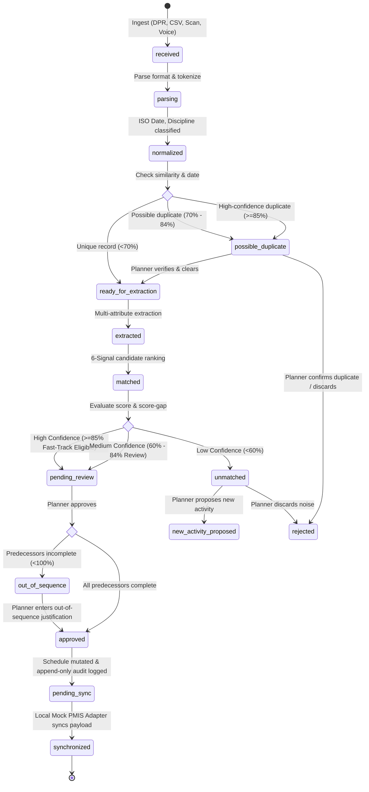

# STATE LIFECYCLE, MUTATION & PERSISTENCE SPECIFICATION
## SIH 2026 — Problem Statement 26122 (Oil India Limited)
**Project Title:** Intelligent Data Capture & Schedule-Linking Layer for Infrastructure Project Management: Real-Time Actual Progress Tracking  
**Target Context:** Baghewala Surface Facilities Expansion (Jaisalmer Basin, Rajasthan)  
**Document Type:** Technical State Machine & Data Persistence Specification  

---

## 1. End-to-End State Machine Lifecycle

To prevent unverified site reports from corrupting the master schedule, progress records transition through a strict, linear state machine with mandatory human review boundaries:



### Direct Transition Invariant:
A field record **must never** jump directly from `received` to `synchronized` or from `extracted` to `approved` without passing through the planner review boundary.

---

## 2. Review Boundaries & Human-in-the-Loop Gating

| Interaction Point | Button Label | State Progression | Operational Rule |
|---|---|---|---|
| **Data Ingestion Hub** | `Ingest and Process for Review` | `received` $\rightarrow$ `ready_for_extraction` | Ingestion only parses and normalizes; does not alter schedule. |
| **Supervisor Time Agent** | `Confirm and Submit for Review` | `received` $\rightarrow$ `pending_review` | Captures field log into structured queue; does not bypass planner. |
| **Extraction Workspace** | `Save Extracted Physical Quantity` | `ready_for_extraction` $\rightarrow$ `extracted` | Extracted quantity remains unverified until planner confirmation. |
| **Schedule Linker** | `Fast-Track Confirm` | `matched` $\rightarrow$ `pending_review` | Fast-track eligibility streamlines review, but requires planner click. |
| **Planner Review Queue** | `Approve Schedule Update` | `pending_review` $\rightarrow$ `approved` | Mutates schedule and commits append-only audit record. |
| **Gantt & Schedule View** | `Preview PMIS Update` $\rightarrow$ `Sync to Mock PMIS` | `approved` $\rightarrow$ `synchronized` | Inspects representative payload before dispatch to local mock adapter. |

---

## 3. Predecessor Validation & Out-of-Sequence Rules

When a planner attempts to approve an activity:
1. **Predecessor Check:** The system inspects all activities listed in `predecessorIds`.
2. **Incomplete Predecessor Rule:** If any predecessor activity has `percentComplete < 100%`:
   - State shifts to `out_of_sequence`.
   - Approval is paused.
   - An alert dialog displays the specific incomplete predecessor (e.g. `CIV-L6-012 Foundation Curing at 50%`).
   - A mandatory **Planner Justification Note** must be entered before the approval can be committed.
3. **Audit Recording:** The justification is permanently stored in the audit entry diff (`reason: Out-of-sequence override: ...`).

---

## 4. Schedule Mutation Rules

Upon approval of a progress event, the schedule activity mutates according to explicit rules:

1. **Actual Start Date:**
   - If `actualStart` is null, set to `eventDate`.
2. **Actual Quantity & Percent Complete:**
   - $\text{actualQuantity} = \text{reportedQuantity}$
   - $\text{remainingQuantity} = \max(0, \text{plannedQuantity} - \text{actualQuantity})$
   - $\text{percentComplete} = \text{round}\left(\frac{\text{actualQuantity}}{\text{plannedQuantity}} \times 100, 1\right)$
3. **Actual Duration & Baseline Variance:**
   $$\text{actualDuration} = (\text{statusDate} - \text{actualStart}) + 1\text{ day}$$
   $$\text{durationVariance} = \text{actualDuration} - \text{plannedDuration}$$
4. **Status Flag:**
   - If $\text{percentComplete} = 100\%$, `status = 'Completed'`.
   - If $0\% < \text{percentComplete} < 100\%$, `status = 'In Progress'`.

---

## 5. Append-Only Audit Trail State

Every state mutation generates a persistent audit entry stored in the relational SQLite repository:

- **Immutability Contract:** Existing audit entries cannot be edited or deleted through any UI screen or API endpoint.
- **Attributed Fields:**
  - `id`: Unique audit identifier (`aud-009`).
  - `timestamp`: High-precision ISO timestamp (`2026-09-19T14:25:00+05:30`).
  - `actorName`: Logged-in user name (`Lead Planner`).
  - `actorRole`: `PLANNER` | `SUPERVISOR` | `ENGINEER` | `PM`.
  - `action`: `APPROVE` | `REMAP` | `SPLIT` | `REJECT` | `PROPOSE_NEW` | `MOCK_PMIS_SYNC`.
  - `beforeValue`: Complete JSON snapshot of pre-mutation entity state.
  - `afterValue`: Complete JSON snapshot of post-mutation entity state.
  - `reason`: Justification text or trigger description.
  - `evidenceReference`: Direct URI to raw source document or snippet.
  - `transactionId`: Local mock transaction identifier (`TX-DEMO-001`).

---

## 6. Forward 6-Point Evidence Lineage Order

The evidence drawer reconstructs the forward causal chain from physical origin to schedule mutation:

```
Step 1: Source File
        ├── Source Name: DPR_2026_09_12_Piping.pdf
        └── Submitted By: R. Sharma (Piping Supervisor)
Step 2: Extracted Source Snippet
        ├── Quote: "18 of 24 joints completed"
        └── Character Span: [40 to 65]
Step 3: Structured Progress Event
        ├── Extracted Quantity: 18 joints (75.0%)
        └── Location: North Pipe Rack (Line 24-XX)
Step 4: Ranked Schedule Match
        ├── Matched Activity: PIP-L6-024A
        ├── Base Score: 94.8% (Unambiguous)
        └── L6 Priority: Applied as routing tie-breaker
Step 5: Planner Approval Gate
        ├── Actor: Lead Planner (Attributed)
        ├── Timestamp: 2026-09-19 14:25 IST
        └── Justification: Verified against site welding log
Step 6: Approved Schedule Update
        ├── Schedule Status: In Progress (75.0%)
        ├── Baseline Variance: +1.0 Days
        └── Supporting Detail: Representative Mock PMIS Payload
```

---

## 7. Indicative Forecasting Formula & Fallback Rules

Project completion forecasting is strictly labeled as **indicative**:

$$\text{Forecast Finish} = \text{Data Date} + \frac{\text{Remaining Quantity}}{\text{Observed Productivity}}$$

### Strict Fallback Conditions:
The forecast must only be calculated from verified, approved actuals. The forecast is **unavailable** if:
1. Observed productivity is zero ($\text{velocity} \le 0$).
2. Remaining quantity is missing or undefined ($\text{remaining} \le 0$).
3. No approved progress records exist.

### Required Fallback Display:
```
Prototype Forecast — Indicative
Forecast unavailable — insufficient approved quantity or productivity data.
```
This ensures unverified extracted data or unapproved claims never distort projected milestone dates.

---

## 8. Persistence & Demo Reset Lifecycle

1. **Relational SQLite Persistence:** All project activities, field inputs, progress events, audit logs, and memory items persist in `data/oil_india_baghewala.db` via the Node.js API server (`:3001`).
2. **Demo Baseline Reset:**
   - Triggered via navigation bar button: `Reset Demo to Baseline`.
   - Invokes `POST /api/demo/reset`.
   - Clears mutated transaction records and restores pristine synthetic Baghewala baseline (1 project, 19 activities, 7 field records, 8 initial audit entries).
   - Response confirmation displays simple dynamic notification: `Reset complete`.
