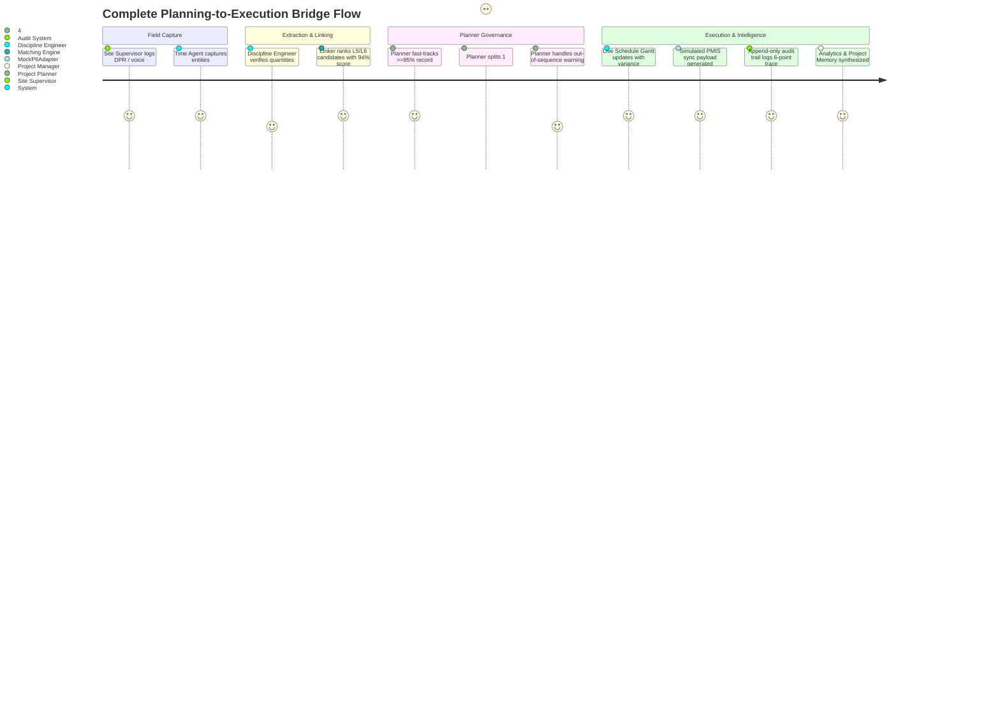

# USER FLOWS & INTERACTION ARCHITECTURE
## SIH 2026 — Problem Statement 26122 (FieldLink Platform)
**Project Title:** Intelligent Data Capture & Schedule-Linking Layer for Infrastructure Project Management: Real-Time Actual Progress Tracking  

---

## 1. Primary End-to-End User Journeys

---

## 2. Detailed Step-by-Step User Flows

### Flow 1: Site Supervisor Conversational Field Logging (Time Agent)
1. **Entry:** Supervisor opens `/time-agent` on a tablet or mobile device.
2. **Action:** Clicks the audio preset chip: *"Piping crew erected Line 24-XX spool in north rack; 18 of 24 joints complete."*
3. **System Feedback:** Chat message renders instantly; system displays the **Entity Preview Card**:
   - Detected Discipline: `PIPING`
   - Target Line: `Line 24-XX`
   - Extracted Progress: `18/24 Joints (75%)`
   - Candidate Activity: `PIP-L6-024A — Erect Line 24-XX`
   - Confidence: `94% (High)`
4. **Confirmation:** Supervisor taps large green button: **`Confirm & Log Entry`**.
5. **Outcome:** Record enters ingestion queue with separate capture and approval statuses.

---

### Flow 2: Discipline Engineer Verification & Phrase Highlighting
1. **Entry:** Discipline Engineer navigates to `/extraction`.
2. **Action:** Selects the newly ingested Piping DPR record.
3. **Split-Screen Inspection:**
   - Left pane displays verbatim DPR text.
   - Right pane displays extracted structured form fields.
4. **Interaction:** Clicking on the right-hand `18 joints` field instantly highlights the corresponding text `"18 of 24 joints completed"` in yellow in the left pane.
5. **Correction:** Engineer adjusts location from generic *"North rack"* to canonical *"North Pipe Rack - Bay 3 to 7"*.
6. **Action:** Clicks **`Save & Send to Linker →`**.

---

### Flow 3: Project Planner Fast-Track Review & Explainable Linking
1. **Entry:** Planner navigates to `/linker` (or `/review`).
2. **Candidate Evaluation:** System displays candidate cards ranked by multi-signal score:
   - Rank 1: `PIP-L6-024A: Erect Line 24-XX` — **94% Confidence (HIGH)**
   - Rank 2: `PIP-L5-024: Line 24-XX Installation` — **78% Confidence (Level 5 Parent)**
   - Rank 3: `PIP-L6-025: Hydrotest Line 24-XX` — **42% Confidence (Wrong Craft Stage)**
3. **Explainability:** Planner clicks `View Score Breakdown` to inspect the 6 component bars (Text 92%, Discipline 100%, Location 95%, WBS 90%, Date 100%, Synonym 88%).
4. **Approval:** Because score is $\ge 85\%$, planner clicks **`Fast-Track Approve`**.
5. **Outcome:** Schedule updates immediately, audit log is written, and analytics refresh.

---

### Flow 4: 1:N Granularity Allocation (Composite Work Split)
1. **Scenario:** Field record states: *"Completed joint fit-up, welding, and radiography for Line 24-XX."*
2. **Action:** Planner clicks **`Split into 1:N Activities`** in the Review Queue.
3. **Modal Display:** A dedicated 1:N Splitter modal opens with pre-configured piping distribution templates:
   - `PIP-L6-024A (Fit-up)`: Slider set to **20%**
   - `PIP-L6-024B (Welding)`: Slider set to **50%**
   - `PIP-L6-024C (NDT / Radiography)`: Slider set to **30%**
4. **Validation:** System checks that the sum of sliders equals exactly **100%**.
5. **Confirmation:** Planner enters justification (*"Composite joint completion allocated per standard craft weightage"*) and clicks **`Confirm 1:N Split`**.
6. **Outcome:** Three linked child progress events are generated, each updating its respective activity without directly dictating total activity percent complete.

---

### Flow 5: Out-of-Sequence Predecessor Resolution
1. **Scenario:** Field reports `PIP-L6-024A (Spool Erection)` in progress, but predecessor `CIV-L5-012 (Equipment Foundation)` is only 40% complete in the schedule.
2. **Detection:** When planner clicks approve, the system intercepts the action and displays the **Out-of-Sequence Alert Modal**:
   > *"⚠️ Predecessor Conflict Detected: CIV-L5-012 is only 40% complete. Schedule synchronization paused."*
3. **Justification:** Planner enters mandatory note: *"Erection proceeded on temporary scaffolding before pedestal completion."*
4. **Confirmation:** Planner clicks **`Confirm Override & Record Progress`**.
5. **Outcome:** Actual progress is approved and logged with the justification note attached. Predecessor schedule logic is left completely unmodified.

---

### Flow 6: Unmatched / New Activity Candidate Proposal
1. **Scenario:** Field report states: *"Temporary access platform installed near tank farm."*
2. **Detection:** Matching engine finds no reliable baseline match; score is 42% (`<60%`).
3. **Queue Placement:** Record appears in the Review Queue under the **`Unmatched / New Scope`** tab with a red badge.
4. **Action:** Planner clicks **`Propose as New Activity`**.
5. **Form Entry:** Proposal dialog pre-populates discipline as `CIVIL / STRUCTURAL` and parent WBS as `Tank Farm Facilities`.
6. **Confirmation:** Planner clicks **`Add to Proposed Scope`**.
7. **Outcome:** Activity is added to the schedule as an uncommitted change-order item without corrupting the baseline.

---

### Flow 7: Live Schedule Sync & Mock P6 Payload Inspection
1. **Entry:** User navigates to `/schedule`.
2. **Gantt Inspection:** Baseline bars (slate) and approved actual progress bars (teal/green) are displayed side-by-side with duration variance badges (`+1.0 Days`).
3. **Synchronization Action:** Planner clicks **`Simulate PMIS Sync 🔄`**.
4. **Feedback:** Status badge transitions from `Pending Sync` to `Synchronized to PMIS` with a green checkmark.
5. **Inspection Action:** Planner clicks **`Inspect P6 Payload 📋`**.
6. **Drawer Display:** Slide-out drawer opens displaying representative P6-compatible JSON/XML payload with activity code, actual start date, physical percent complete, and status 200 OK mock response.

---

### Flow 8: Indicative Forecasting & Interactive What-If Simulation
1. **Entry:** Project Manager navigates to `/analytics`.
2. **S-Curve Review:** Compares cumulative planned S-curve against actual progress curve.
3. **Forecast Review:** Reviews the Indicative Forecast finish date (`2027-05-04`), noting the projected 4-day baseline slip.
4. **What-If Simulation:**
   - Selects activity: `PIP-L6-025 (Hydrotest Line 24-XX)`.
   - Adds delay: `+5 Days` (Reason: `Test pump unavailable`).
   - Clicks `Simulate Delay Impact`.
5. **Impact Visualization:** Downstream activities shift visually on the impact preview table, showing the projected project completion date moving out by 5 days without altering live baseline data.

---

### Flow 9: The 5-Act Guided Demo Walkthrough (For SIH Judges)
A dedicated **`Start Guided Demo 🚀`** button in the top bar allows presenting the entire end-to-end flow in under 4 minutes:
- **Act 1 (0:00 - 0:45):** Ingestion of the piping DPR note via `/ingestion`.
- **Act 2 (0:45 - 1:45):** Extraction highlighting in `/extraction` and explainable 94% match in `/linker`.
- **Act 3 (1:45 - 2:45):** Handling ambiguous foundation work and approving piping in `/review`.
- **Act 4 (2:45 - 3:30):** Live Gantt variance and P6 payload inspection in `/schedule` + 6-point trace in `/audit`.
- **Act 5 (3:30 - 4:00):** S-curves, What-If simulation in `/analytics`, and institutional memory card in `/memory`.
